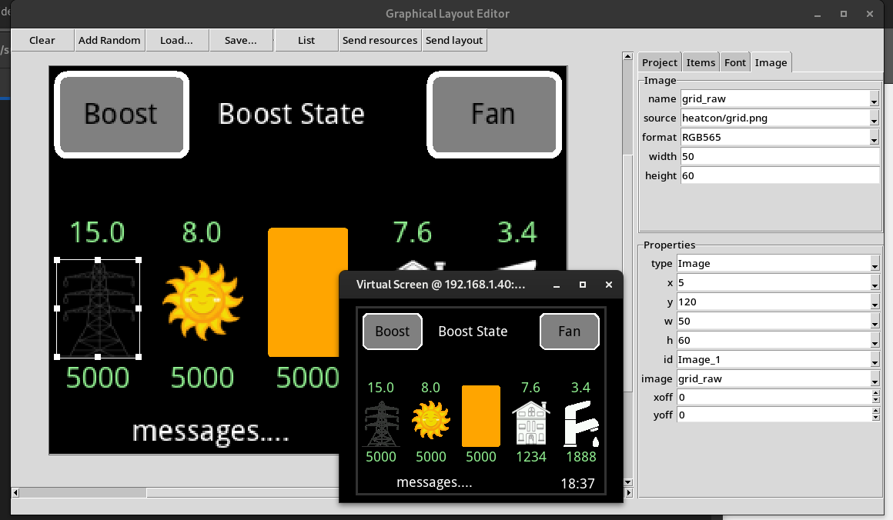

Graphical Editor
================

This is a simple GUI layout tool to assist with placement and setting attributes, etc. for objects.

It is still very much a work-in-progress but should still be of some assistance.

See below for installation requirements.
The :sample:`Graphic_Editor` sample application demonstrates updating the screen in a running application.

Project files have a ``.ged`` file extension and are in JSON format.
They should be easy to read and parse to suit any particular application.

User Interface
--------------

Top menu buttons:
    - **Clear** Reset everything ready to create a new layout
    - **Add random** Add some random items to the screen (testing)
    - **Load** Load project file
    - **Save** Save project file
    - **List** Dump project data to console
    - **Send resources** Send resource block to :sample:`Graphic_Editor` application
    - **Send layout** Send layout information and update :sample:`Graphic_Editor` screen

On the right is context-sensitive information in pages.

Project
    General project information.

    - **Client** IP address for device running :sample:`Graphic_Editor` sample application
    - **Width**, **Height**, **Orientation** target device attributes
    - **Scale** reflects zoom level for editing area
    - **Grid alignment** Set grid snapping in pixels

Items
    Lists all items in layout, synchronised with selection.
    Item ordering can be adjusted using navigation shortcuts listed below.

Font
    Allows editing of font resources.
    - To add a new font, type a new name then select the font **family**.
    - To change font parameters select its name from the list and amend fields as required.

    Note that only system opentype/truetype fonts are selectable.
    Other font types as discussed in :library:`Graphics` are not currently supported in the editor.

    Parameters:
        - **name** Name of font resource as referred to in layout
        - **family** Available system fonts to use
        - **size** Which size to compile the font in
        - **mono** Whether to use grayscale (looks better) or monochome (saves memory)
        - **normal**, **bold**, **italic**, **bold-italic**. Which typefaces will to compile for the application.

Image
    Allows basic editing of image resources

    Parameters:
        - **name** Name of image resource as referred to in layout
        - **source** Path to source image file (e.g. png, jpeg, etc.)
        - **format** Which format to convert this image to.
          Ideally this matches the target device (RGB24, RGB565) to avoid processing overhead.
          If left blank then the raw source data will be used; it's up to the application
          do perform any decoding, etc.
        - **width**, **height** Dimensions for converted image. Ignored if **format** is blank.

Properties
    Shows details of selected item.
    If multiple items are selected then shows only attributes common to all items.
    For some fields (e.g. width) a drop-down list contains values for each item.
    For other fields (e.g. type) shows possible values.
    Note: Cannot currently change item type.

Complex edits such as renaming font resources can always be done by manually editing the project file as it's a pretty simple format.
Make sure to back it up first, though!

Navigation
----------

==========================  ===========================================
Action                      Key combination
==========================  ===========================================
**Pan/Zoom**
Pan left/right              Mouse Wheel
Pan up/down                 Shift + Wheel
Zoom                        Ctrl + Wheel
                            Right-Click + Wheel
Pan window                  Right-Click, hold and move mouse

**Add new item of type**
Rectangle (outline)         R
Filled Rectangle            Shift + R
Ellipse (outline)           E
Filled Ellipse              Shift + E
Image                       I
Text                        T
Button                      B
Label                       L

**Selection**
Select item                 Left-Click
Duplicate item(s)           Ctrl+D
Add item to selection       Ctrl + Left-Click
Remove item from selection  Not implemented
Delete item(s)              Delete
Copy items(s)               Not implemented
Paste items(s)              Not implemented
Undo last operation         Not implemented
Select all items            Ctrl + A
Move selected items         Left-Click, Drag with mouse
                            Cursor keys
                            +Shift don't snap to grid
Adjust selection bounds     Left-Click on selection handle, drag
                            +Shift don't snap to grid
                            +Ctrl scale items inside selection

**Change Z-order**
Move to top                 Home
Move to bottom              End
Move up                     Page-Up
Move down                   Page-Down
==========================  ===========================================

Design goals
------------

- Platform portability
    - Uses python 'tkinter' library which is old but universally supported
- Simplicity
    - quick and easy to use
    - requires minimal display parameters (size, pixel format)
    - minimal install dependencies, no compilation required
- Accurate
    - Pixel layout corresponds to actual hardware, not just some idealised representation
- Easy to modify/extend, e.g.
    - adding additional export formats

TODO
----

Features to add:

code generation
    At present this is left up to the application.
    For simple layouts it can be done manually.
    A python or javascript can be used to parse the JSON project file.

    Preferably generate data blocks which can be imported into applications.
    Some will be static, e.g. screen backgrounds, 
    May require code generation but if so keep to an absolute minimum.
    Data blocks can incorporate logic (Graphics::Drawing).

editing
    - multiple selections
    - cut & paste
    - undo / redo

Grouping / overlays / scenes
  - e.g. common page background ('master page')
  - concept of 'scene library' perhaps

Resource script integration
  - export/import to/from .rc files
  - select fonts
